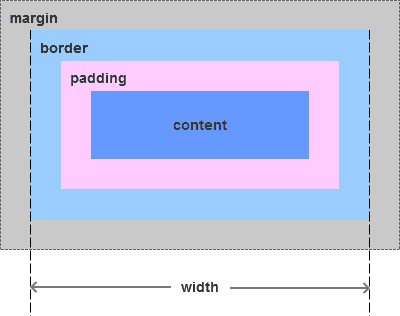

# BOX MODEL

## 什么是 Box Model

浏览器在渲染`html tag`时会将其视为一个个的盒子

每个盒子由 4 部分组成:

- `content`内容区
- `padding`内边距
- `border`边框
- `margin`外边距

`content`就是嵌入子盒子的区域(不包括定位元素)

## Box Model 的分类

盒模型可以分为 2 类:

- `IE盒模型`

- `标准盒模型`

他们的区别在于计算`content`的不同

---

我们通过`CSS`设置的`width`和`height`

- 在`标准盒模型`中表示为`content`的大小

  

- 在`IE盒模型中`表示为`content + padding + border`的大小

  

图片来源于[https://segmentfault.com/a/1190000013069516](https://segmentfault.com/a/1190000013069516)侵删

举个 🌰

```html
<div id="ie" class="box">IE</div>
<div id="standard" class="box">Standard</div>

<style>
  .box {
    width: 100px;
    height: 100px;
    padding: 20px;
    border: 5px solid black;
    margin: 20px;
    background-color: coral;
  }

  #ie {
    box-sizing: border-box;
  }

  #standard {
    box-sizing: content-box;
  }
</style>

<!-- IE模型的content 为 50 * 50-->
<!-- 标准模型的content 为 100 * 100-->
```

<div id="ie" class="box">IE</div>
<div id="standard" class="box">Standard</div>

<style>
.box {
  width: 100px;
  height: 100px;
  padding: 20px;
  border: 5px solid black;
  margin: 20px;
  background-color: coral;
}

#ie {
  box-sizing: border-box;
}

#standard {
  box-sizing: content-box;
}
</style>

## 如何设置 2 种 Box Model

- `box-sizing: border-box`

IE盒模型

- `box-sizing: content-box`(html5 默认)

标准盒模型

## 如何获得 Box Model 的宽/高

获得盒模型的宽/高实际上就是获得元素的属性, 有以下4种方式

- `dom.style`
- `dom.currentStyle`(IE, 很少使用)
- `window.getComputedStyle(dom)`
- `dom.getBoundingClientRect()`

我不在这里介绍他们的区别, 因为这不属于这章的内容

## dom.getBoundingClientRect()

这里我要提一下`dom.getBoundingClientRect()`这个API, 这个API会获得一个对象, 其中`width`和`height`指的并不是我们通过`CSS`设置的`width`和`height`的数值

而是`border + padding + contain`的大小, 这对于一些需要位移元素的需求很有意义

举个🌰

UE提出了**平滑锚点定位**的需求, 但是某些移动端浏览器不支持平滑滚动, `scroll-behavior: smooth;`

---

这就不能通过浏览器的`hash`定位实现

我们要使用`transition`或者`JS`来实现来完成

所以我们要计算各个`<tab>`的占据空间的大小(`可视区 + margin`), 但是这些`<tab>`的可视区会受到`盒模型类型`, `padding`和`border`的影响

**IE可视区**: `width/height`

**standard可视区**: `width/height + padding + border`

而通过`window.getComputedStyle(tab)`来获取的`宽/高`, 只能得到通过`CSS`设置的`width/height`的值, 还需要获得`padding`, `border`以及`盒模型`, 才能够得到元素的`可视区`

使用`dom.getBoundingClientRect()`会得到一个对象, 其中`width/height`不是`CSS`设置的`width/height`, 而是元素可视区的大小, 不用区分`盒模型`, 接下来就要获得`margin`就可以了

下面是通过`dom.getBoundingClientRect()`获得的上面🌰 的元素信息

```js
window.addEventListener('load', function() {
  const ie = document.getElementById('ie');
  const standard = document.getElementById('standard');
  const themeContent = document.querySelector('.theme-default-content.content__default');

  [{ name: 'ie盒模型', dom: ie }, { name: 'standard盒模型', dom: standard }].forEach(({ dom, name}) => {
    const p = document.createElement('p');
    const pre = document.createElement('pre');

    p.innerText = name;
    pre.innerText = JSON.stringify(dom.getBoundingClientRect(), null, 2);
    pre.style.background = 'aliceblue';

    themeContent.appendChild(p);
    themeContent.appendChild(pre);
  });
});
```
<script>
window.addEventListener('load', function() {
  const ie = document.getElementById('ie');
  const standard = document.getElementById('standard');
  const themeContent = document.querySelector('.theme-default-content.content__default');

  [{ name: 'ie盒模型', dom: ie }, { name: 'standard盒模型', dom: standard }].forEach(({ dom, name}) => {
    const p = document.createElement('p');
    const pre = document.createElement('pre');

    p.innerText = name;
    pre.innerText = JSON.stringify(dom.getBoundingClientRect(), null, 2);
    pre.style.background = 'aliceblue';

    themeContent.appendChild(p);
    themeContent.appendChild(pre);
  });
});
</script>
