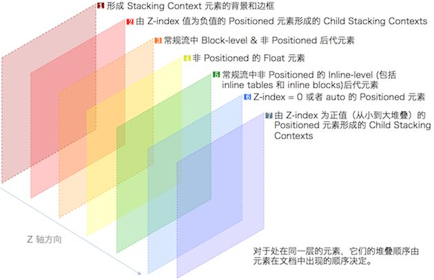

# STACKING CONTEXT

讲一个故事

曾经在前司做了一个微信小程序的需求, 其部分UI内容是`tag`要覆盖到`swiper`上面

```html
<product-ad>
  <swiper>
    <product />
  </swiper>
  <tag>
</prodcut-ad>

.wxss
<style>
.product-ad {
  position: relative;
}

.tag {
  position: absolute;
  top: 0;
  left: 0;
  z-index: 10;
}
</style>

<!--  大概就是这样吧 -->
```

结果上线第二天, `IOS13`来了, 升级了`IOS13`的粪X 其中的UI ci...........的就挂掉了

本来好好的`tag`覆盖到`swiper`上变成了`swiper`覆盖到`tag`上

omg!!! 心态炸裂(根本不知道为什么, 反正`IOS13`bug多, 开启甩锅模式), 通过控制台发现`swiper wrap`的`position`属性是0(好像是, 太久了记不太清, 能确定的是小于`tag`的`zIndex`)

后来呢, 一不小心给`tag`增加了个`transform`就`fix`了

```html {8}
<style>
.tag {
  position: absolute;
  top: 0;
  left: 0;
  z-index: 10;

  transform: translateZ(10rpx);
}
</style>
```

...

怎么`fix`, 为什么会层级顺序变了, 现在我依旧毫无头绪, 就连定位问题的方向都找不到

只能确定不是`css`的问题, 因为只有`IOS13`的粪X ci了, 剩下的...

但是对于`Web`来讲如果你的UI层叠样式发生了你所不理解的异常, 你可能需要认真复习一下`Stacking Context`

本篇笔记通过介绍以下几点希望能让你理解`CSS`的层叠概念

- **层叠上下文**
- **层叠顺序**
- **z-index: auto的子元素的层级顺序和父元素的层级顺序一致**

## 浏览器是如何确定元素间的覆盖关系

我们所看到的2D`html`平面, 在浏览器内是一个3D模型, 浏览器根据这个3D模型在Z轴上的排列顺序确定元素间的覆盖关系, 在Z轴最前面的元素会被覆盖到最上面

(当然某些属性还会让浏览器重新构建出另一个3D模型, 比如`position: fixed`会创建另一个Layer, 浏览器最终将多个Layer复合到一起就形成了我们看到的页面)

这个Z轴排列的顺序就是**层叠顺序**(层叠顺序高在Z轴前面), 同时这个**层叠顺序**有属于它们的作用域(**层叠上下文**)

- **层叠顺序的比较只在同一个层叠上下文内才有意义**

- **不同上下文内的元素要从自身开始递归直到它们某个产生了层叠上下文的父元素(如果是自身的话则不用产生层叠上下文)在同一个层叠上下文内才能比较, 元素的比较就是递归到的父元素(包括自身)的层叠顺序的比较**

- **同一层级顺序, 后解析的DOM在前**

看一下下面的几个🌰

<style>
.wrap {
  height: 130px;
}
.father_1 {
  width: 100px;
  height: 100px;
  background-color: antiquewhite;
}

.father_1_son {
  width: 50px;
  height: 50px;
  background-color: black;
}

.father_2 {
  width: 100px;
  height: 100px;
  background-color: aqua;
}

.father_2_son {
  width: 50px;
  height: 50px;
  background-color: coral;
}
</style>
```html
<style>
/* common, 下面🌰就只给出关键代码了 */
.wrap {
  height: 130px;
}
.father_1 {
  width: 100px;
  height: 100px;
  background-color: antiquewhite;
}

.father_1_son {
  width: 50px;
  height: 50px;
  background-color: black;
}

.father_2 {
  width: 100px;
  height: 100px;
  background-color: aqua;
}

.father_2_son {
  width: 50px;
  height: 50px;
  background-color: coral;
}
</style>
```

### 层叠顺序的比较只在同一个层叠上下文内才有意义Demo
```html {11-12}
<section id="demo1">
  <div class="father_1"> <!-- 棕色 -->
    <div class="father_1_son"></div> <!-- 黑色 -->
  </div>
  <div class="father_2"> <!-- 浅蓝色 -->
    <div class="father_2_son"></div> <!-- 橘色 -->
  </div> 
</section>
<style>
#demo1 .father_1 {
  position: absolute;
  z-index: 20;
  /* 产生了堆叠上下文 */
  top: 0;
}

#demo1 .father_1_son {
  position: absolute;
  z-index: 40;
}

#demo1 .father_2 {
  position: absolute;
  z-index: 30;
  top: 30px;
}
</style>
```

<section id="demo1" class="wrap">
  <div class="father_1">
    <div class="father_1_son"></div>
  </div>
  <div class="father_2">
    <div class="father_2_son"></div>
  </div>
</section>
<style>
#demo1 {
  position: relative;
}
#demo1 .father_1 {
  position: absolute;
  top: 0;
  z-index: 20;
}
#demo1 .father_1_son {
  position: absolute;
  z-index: 40;
}
#demo1 .father_2 {
  position: absolute;
  top: 30px;
  z-index: 30;
}
</style>

可以发现虽然`father_1_son`的`zIndex`是40, `father_2`的`zIndex`是30, 但是`father_2`依旧覆盖到`father_1_son`上

### 不同层级上下文内的元素是如何比较的

还是上面的🌰

`father_2`和`father_2_son`为什么会覆盖到`father_1_son`的上面呢

- `father_2`覆盖到`father_1_son`的上面

这是因为`father_1`产生了堆叠上下文, 堆叠上下文内的`father_1_son`和堆叠上下文外的`father_2`无法比较

只能各自从自身开始递归产生层叠上下文的元素直到在同一个层叠上下文下, 会发现`father_2`和`father_1_son`的父元素`father_1`在同一个堆叠上下文(由`html`产生)下

所以`father_2`和`father_1_son`的比较就是`father_2`和`father_1`的比较, `father_2`的`zIndex`是30, `father_1`的`zIndex`是20

所以...

- `father_2_son`覆盖到`father_1_son`的上面

因为他们在不同的层叠上下文内, 所以他们要递归找到在同一个层叠上下文内的父/自身元素得到`father_1`和`father_2`

所以`father_2_son`和`father_1_son`的层叠顺序比较就是就是`father_1`和`father_2`的层叠顺序比较

所以...

### 同一层级顺序, 后解析的DOM在前

```html
<div id="demo2">
  <div class="father_1"></div><!-- 棕色 -->
  <div class="father_2"></div><!-- 浅蓝色 -->
</div>

<style>
#demo2 .father_2 {
  margin-top: -50px;
}
</style>
```

<div id="demo2">
  <div class="father_1"></div>
  <div class="father_2"></div>
</div>

<style>
#demo2 .father_2 {
  margin-top: -50px;
}
</style>

`father_2`和`father_1`都是`block`级别的层叠顺序, 但是`father_2`覆盖了`father_1`

## 层叠顺序

`html`元素按照如下顺序覆盖, 后提到的会覆盖前面提到的

- **产生Stacking Context的元素的background/border**
- **z-index<0的(定位, flex-item, grid-item)元素**
- **块级性质的元素, 包括display: flex...**
- **浮动元素(不具有定位, 如果有定位的话, 按照z-index处理)**
- **行级性质的元素**
- **z-index为auto或者0的(定位, flex-item, grid-item)元素, 还包括由其他属性产生Stacking Context的元素(`transform`, `opacticy < 1`, `filter`)**
- **z-index > 0, 由z-index大小定义顺序**

::: tip 提示

如果定位元素, flex-item和grid-item元素的`z-index: auto(默认值)`

那么其子元素如果不显示使用`z-index`(这里的`z-index`要生效才可以)指定的话, 那么子元素的层叠顺序和父元素的层叠顺序一致

这点后面会提及, 只是不想让知识分散, 所以在这里提一下

:::

单纯的文字叙述比较枯燥, 看一下下面的2张图片




图片分别来源于[张鑫旭-层叠上下文和层叠顺序](https://www.zhangxinxu.com/wordpress/2016/01/understand-css-stacking-context-order-z-index/?shrink=1)[小生方勤-层叠概念](https://mp.weixin.qq.com/s/xqGtmbvs7H59hnWP2ZLfbA)侵删

::: tip z-index

现在我们可以知道`z-index`不仅作用于定位元素, 还可以作用于`flex-item`和`grid-item`元素

:::

## 层叠上下文

**层叠上下文**定义了**层叠顺序**的作用域, 满足以下任意条件都会形成**层叠上下文**

- **`<html />`本身就是一个层叠上下文, 就和他是一个BFC是一样的**

- **`position: fixed | sticky`会产生层叠上下文**

- **`z-index`不为`auto`的`position: absolute | relative`, `flex-item`和`grid-item`元素, z-index的默认值就是auto**

- **`filter`不为none元素**

- **`transform`不为none元素**

- **`opacity < 1`的元素**

- **`will-change: 在非初始值的情况下会产生堆叠上下文的CSS属性`, 比如上面的`filter`, `transform`, `opacity`**

- **`-webkit-overflow-scrolling: touch`**

  这个属性在移动端才有用, 触摸滚动有回弹效果

👆是一些我用到过的, 👇介绍一些我没用到过的

- **以下属性不为none**
  - `perspective`
  - `clip-path`
  - `mask / mask-image / mask-border`

- **`isolation` 属性值为 isolate 的元素**

- **`contain` 属性值为 layout、paint 或包含它们其中之一的合成值（比如 contain: strict、contain: content）的元素。**

## zIndex: auto和zIndex: 0的区别

在[张鑫旭大佬介绍层叠上下文的评论区中有一条很有意思的评论, 评论者: 小白菜的白](https://www.zhangxinxu.com/wordpress/2016/01/understand-css-stacking-context-order-z-index/?shrink=1)

```html
<div id="demo3">
  <div class="father_1"><!-- 棕色 -->
    <div class="father_1_son"></div> <!-- 黑色 -->
  </div>
</div>

<style>
#demo3 .father_1 {
  position: absolute;
}
</style>
```

<div id="demo3">
  <div class="father_1"><!-- 棕色 -->
    <div class="father_1_son"></div> <!-- 黑色 -->
  </div>
</div>

<style>
#demo3 {
  height: 100px;
}
#demo3 .father_1 {
  position: absolute;
}
</style>

评论者认为: 

按照层叠上下文的理论, `father_1`的层叠顺序在`z-index: 0`的级别且没有产生层叠上下文

而`father_1_son`的层叠顺序在`block`级别, 小于`z-index: 0`

所以黑色的`father_1_son`不应该在棕色的`father_1`的上面

评论者的想法我是认同的... 后来通过MDN

---

还记得👆为了补充知识的完整性, 在[层叠顺序](/css/stacking_context.html#层叠顺序)中提了一下`z-index: auto`嘛?

**`z-index: auto`生效的元素, 其子元素如果没有显示指定`z-index`那么其层叠顺序是和当前父元素的层叠顺序一致的**

这句话来自于对**MDN**中关于`z-index: auto`的介绍的理解

[原文](https://developer.mozilla.org/zh-CN/docs/Web/CSS/z-index) :

`auto`&nbsp;&nbsp;:  

&nbsp;&nbsp;&nbsp;&nbsp;&nbsp;&nbsp;&nbsp;&nbsp;&nbsp;&nbsp;&nbsp;盒子不会创建一个新的本地堆叠上下文。在**当前堆叠上下文**中生成的盒子的堆叠层级和父级盒子相同。

&nbsp;&nbsp;&nbsp;&nbsp;&nbsp;&nbsp;&nbsp;&nbsp;&nbsp;&nbsp;&nbsp;The box does not establish a new local stacking context. The stack level of the generated box in the **current stacking context** is the same as its parent's box.

人话 ❓

都说了盒子不会创建新的堆叠上下文, 那**当前堆叠上下文**指的是什么, 按照我们🌰  中 难道是`<html />` ? 那所有在`<html />`中的元素不是都有一样的层叠顺序了嘛?

**Are you kidding me ?**

所以根据实际的情况, 我认为其表述的**当前堆叠上下文**应该是当前盒子, 即:

**盒子不会创建一个新的本地堆叠上下文, 在当前盒子中生成的盒子的堆叠层级和当前盒子相同**

---

所以对于上面🌰 的解释就是, `father_1_son`的层叠等级和`father_1`是一致的, 按照**后解析的规则, 覆盖在`father_1`上**

如果你有不同的理解, 欢迎提`PR` or `issue`

---

综上, `z-index: 0`和`z-index: auto`的区别在于

- **`z-index: auto`虽然和`z-index: 0`拥有一样的层叠等级, 但是`z-index: auto`不会产生堆叠上下文**

- **`z-index: auto`的子盒子如果没有显示指定`z-index`的话, 其层叠等级和当前盒子一样**

- **`z-index: 0`则是由于产生了层叠上下文, 其内的元素在和上下文外面的元素比较的时候采用的是父元素的层叠等级**

## Refs

[MDN-层叠上下文](https://developer.mozilla.org/zh-CN/docs/Web/Guide/CSS/Understanding_z_index/The_stacking_context)

[张鑫旭-层叠上下文和层叠顺序](https://www.zhangxinxu.com/wordpress/2016/01/understand-css-stacking-context-order-z-index/?shrink=1)

[小生方勤-层叠概念](https://mp.weixin.qq.com/s/xqGtmbvs7H59hnWP2ZLfbA)
